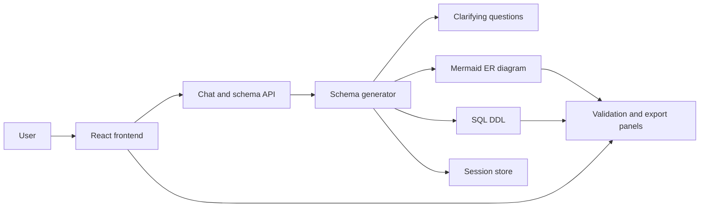
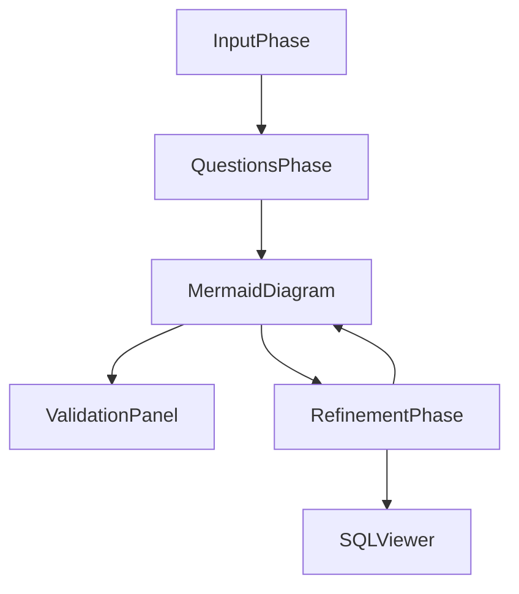
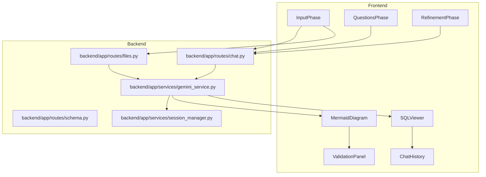

# SchemaFlow

SchemaFlow turns natural language requirements into a Chen-style ER diagram and SQL DDL. The app supports a guided flow with clarifying questions, diagram generation, refinement, validation, and SQL export.

## What It Does

- Accepts a requirement brief or uploaded document as schema context
- Generates targeted clarifying questions when the input is ambiguous
- Builds a Chen ER diagram from the confirmed requirements
- Lets you refine the schema and regenerate the diagram
- Exports SQL for multiple dialects
- Surfaces validation notes so the generated schema stays readable and structured

## At A Glance



## Pipeline



## Block Diagram



## Repository Layout

```text
SchemaFlow/
  backend/
    app/
      models/
      routes/
      services/
      utils/
    main.py
    requirements.txt
  frontend/
    src/
      components/
      context/
      hooks/
      utils/
    package.json
    package-lock.json
  docs/
    architecture.md
  Dockerfile.backend
  Dockerfile.frontend
  docker-compose.yml
  docker-compose.prod.yml
  Makefile
  dev.sh
  .env.example
  .gitignore
```

## Local Setup

Prerequisites:

- Python 3.11+
- Node 18+
- Optional: Docker

Backend:

```bash
cd backend
python -m venv .venv
source .venv/bin/activate
pip install -r requirements.txt
uvicorn main:app --reload --host 0.0.0.0 --port 8000
```

Frontend:

```bash
cd frontend
npm install
npm start
```

Docker:

```bash
docker-compose up --build
```

## Environment

Copy [`.env.example`](./.env.example) to your local `.env` files as needed.

- `backend/.env` can define `GEMINI_API_KEY`, `BACKEND_URL`, `FRONTEND_URL`, and `DEBUG`
- `frontend/.env.local` can define `REACT_APP_API_URL`

The backend works without an API key; the key is optional.

## API Surface

- `POST /api/chat/init`
- `POST /api/chat/confirm-answers`
- `POST /api/chat/refine`
- `POST /api/chat/generate-sql`
- `GET /api/chat/session/{session_id}`
- `POST /api/files/upload`
- `POST /api/schema/questions`
- `POST /api/schema/diagram`
- `POST /api/schema/sql`
- `POST /api/schema/refine`
- `GET /health`

## Key Files

- [backend/main.py](./backend/main.py) wires up FastAPI, routers, and health checks
- [backend/app/services/gemini_service.py](./backend/app/services/gemini_service.py) builds Mermaid and SQL output
- [frontend/src/components/MainApp.jsx](./frontend/src/components/MainApp.jsx) controls the app stages
- [frontend/src/components/InputPhase.jsx](./frontend/src/components/InputPhase.jsx) handles the initial requirement brief
- [frontend/src/components/MermaidDiagram.jsx](./frontend/src/components/MermaidDiagram.jsx) renders and exports the diagram
- [frontend/src/components/SQLViewer.jsx](./frontend/src/components/SQLViewer.jsx) shows the generated SQL

## Documentation

For a deeper explanation of the frontend/backend split and request flow, see [docs/architecture.md](./docs/architecture.md).
# NL-to-ER-Diagram-and-SQL-Generator
