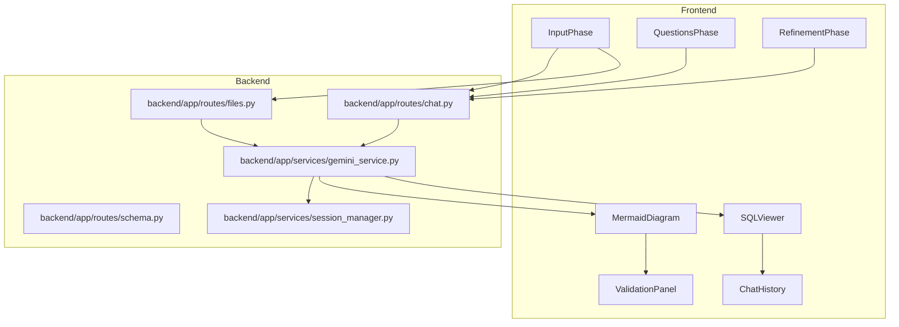

# Multi-Stage NL to ER Diagram and SQL Generator

**A Multi-Stage Question-Driven Framework for Automated Entity-Relationship Modeling and Multi-Dialect SQL Synthesis**  
Developed as part of IEEE-style research work under **Dr. Rishikeshan C. A. (Assistant Professor, School of Computer Science and Engineering, VIT Chennai)**.

Multi-Stage NL to ER Diagram and SQL Generator transforms natural language requirements into Chen-style ER diagrams and SQL DDL statements. The system follows a structured multi-stage pipeline inspired by IEEE research methodology, incorporating ambiguity detection, interactive schema refinement, validation, and multi-dialect SQL generation.

## What It Does

- Accepts requirement briefs or uploaded documents as schema context  
- Generates targeted clarifying questions for ambiguous requirements  
- Builds Chen-style ER diagrams from refined schema definitions  
- Supports iterative schema refinement and regeneration  
- Generates SQL for multiple database dialects  
- Performs structural validation and normalization checks  
- Exports validated schema and SQL outputs  

## Fig. 1(a) At-A-Glance Block Diagram

```mermaid
flowchart LR
    User[User] --> UI[React frontend]
    UI --> Chat[Chat and schema API]
    Chat --> Service[Schema generator]
    Service --> Questions[Clarifying questions]
    Service --> Diagram[Mermaid ER diagram]
    Service --> SQL[SQL DDL]
    Service --> Store[Session store]
    UI --> Review[Validation and export panels]
    Diagram --> Review
    SQL --> Review
````

## Fig. 1(b) Pipeline Block Diagram

```mermaid
flowchart TB
    A[InputPhase] --> B[QuestionsPhase]
    B --> C[MermaidDiagram]
    C --> D[ValidationPanel]
    C --> E[RefinementPhase]
    E --> C
    E --> F[SQLViewer]
```

## Fig. 1(c) Overall System Block Diagram


## Local Setup

### Prerequisites

* Python 3.11+
* Node 18+
* Optional: Docker

### Change the .env.exmaple to .env file and add GEMINI API KEY

### Backend

```bash
cd backend
python -m venv .venv
source .venv/bin/activate
pip install -r requirements.txt
uvicorn main:app --reload --host 0.0.0.0 --port 8000
```

### Frontend

```bash
cd frontend
npm install
npm start
```
## Environment

Copy `.env.example` to local `.env` files.

Backend:

* GEMINI_API_KEY
* BACKEND_URL
* FRONTEND_URL
* DEBUG

Frontend:

* REACT_APP_API_URL

The system works without an API key. API key usage is optional.

## API Surface

* POST /api/chat/init
* POST /api/chat/confirm-answers
* POST /api/chat/refine
* POST /api/chat/generate-sql
* GET /api/chat/session/{session_id}
* POST /api/files/upload
* POST /api/schema/questions
* POST /api/schema/diagram
* POST /api/schema/sql
* POST /api/schema/refine
* GET /health

## Key Files

* backend/main.py — FastAPI initialization and routing
* backend/app/services/gemini_service.py — ER and SQL generation logic
* frontend/src/components/MainApp.jsx — Application state controller
* frontend/src/components/InputPhase.jsx — Input processing
* frontend/src/components/MermaidDiagram.jsx — ER visualization
* frontend/src/components/SQLViewer.jsx — SQL display

## Documentation

Refer to:

docs/architecture.md

for detailed system architecture, pipeline flow, and module explanations.

---

**Authors** <br>
Darsh Soni <br>
Dr. Rishikeshan C. A.<br>
School of Computer Science and Engineering <br>
Vellore Institute of Technology Chennai

---

**IEEE Research Project** <br>
Multi-Stage Question-Driven Framework for Automated <br>
Entity-Relationship Modeling and Multi-Dialect SQL Synthesis


