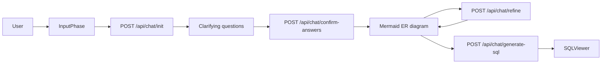
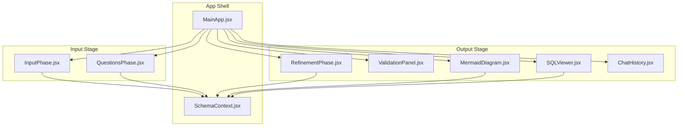
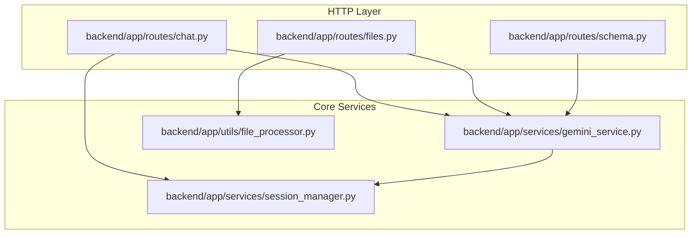

# Architecture

SchemaFlow is organized as a two-layer application:

- `frontend/` renders the guided user flow and displays diagrams, SQL, validation notes, and chat history
- `backend/` handles session state, file ingestion, schema generation, Mermaid rendering, and SQL generation

## Request Flow

## Frontend Blocks

## Backend Blocks

## Why The Repo Is Structured This Way

- The frontend owns the UX state and stage transitions
- The backend owns generation and validation logic, so the diagram output stays consistent
- Session state is isolated so each project flow can be refined independently
- Mermaid output is kept as the source of truth, which makes export and regeneration straightforward

## Files Worth Knowing

- [backend/main.py](../backend/main.py) registers the FastAPI app and routers
- [backend/app/routes/chat.py](../backend/app/routes/chat.py) drives the guided schema flow
- [backend/app/services/gemini_service.py](../backend/app/services/gemini_service.py) renders Mermaid and SQL
- [frontend/src/components/MainApp.jsx](../frontend/src/components/MainApp.jsx) chooses which stage to show
- [frontend/src/components/MermaidDiagram.jsx](../frontend/src/components/MermaidDiagram.jsx) renders the SVG output
- [frontend/src/utils/api.js](../frontend/src/utils/api.js) centralizes API calls

## Notes

- Mermaid diagrams are rendered in the frontend, but the backend generates the actual diagram text
- The schema payload is embedded in Mermaid comments so the app can preserve structure across regeneration
- File upload support is intentionally lightweight so the text extraction layer stays easy to reason about
